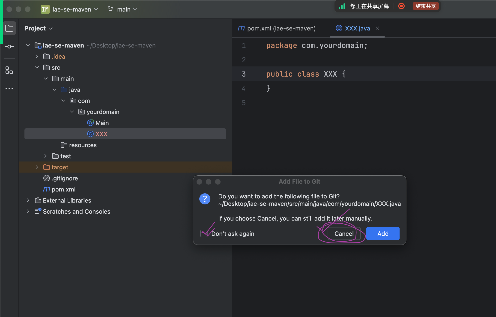
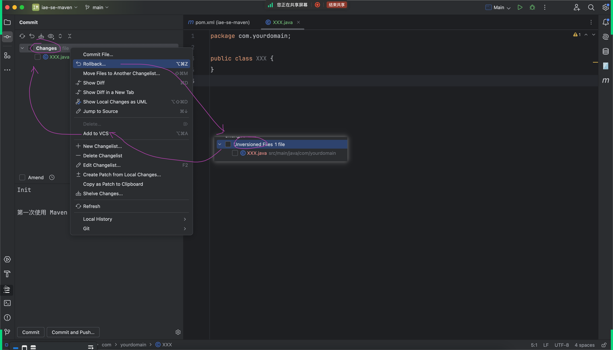
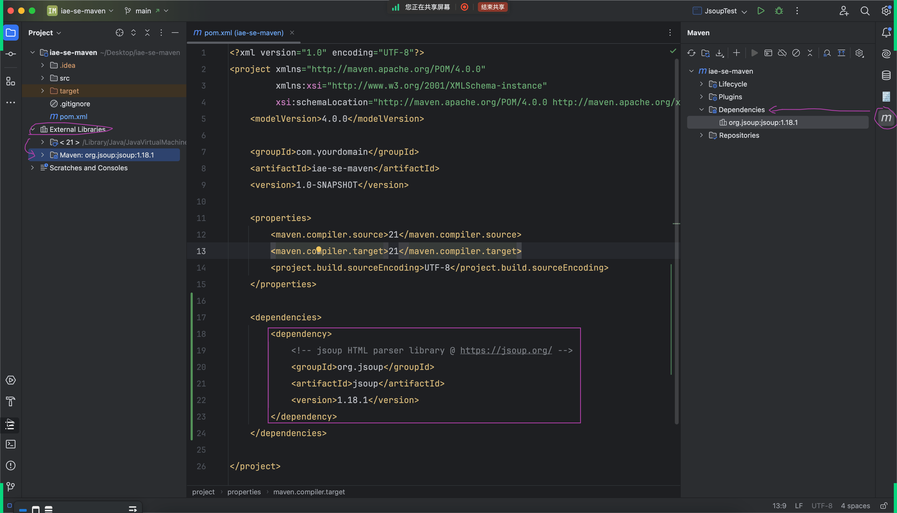
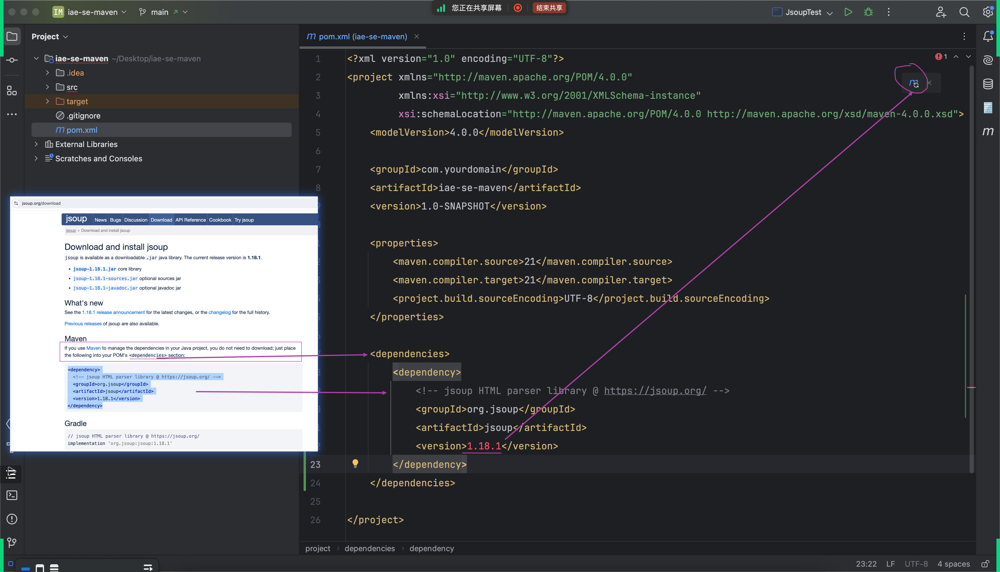
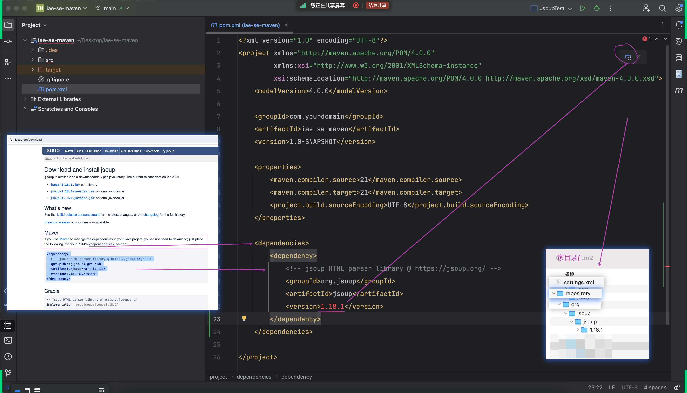
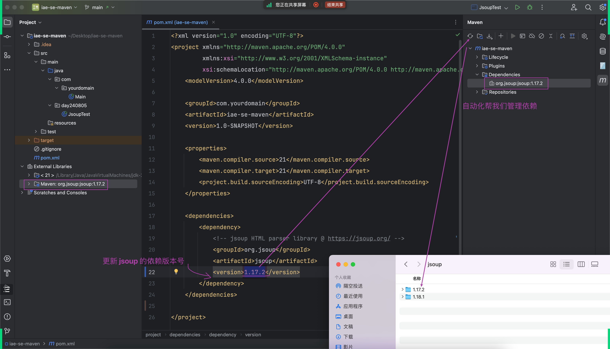
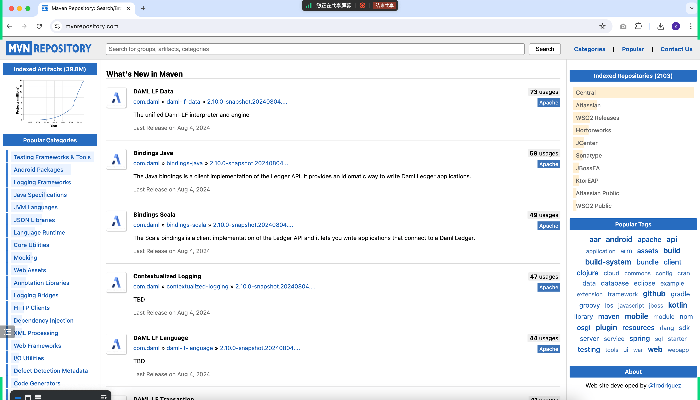
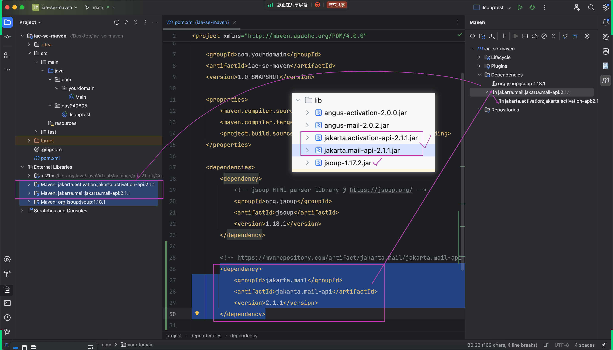
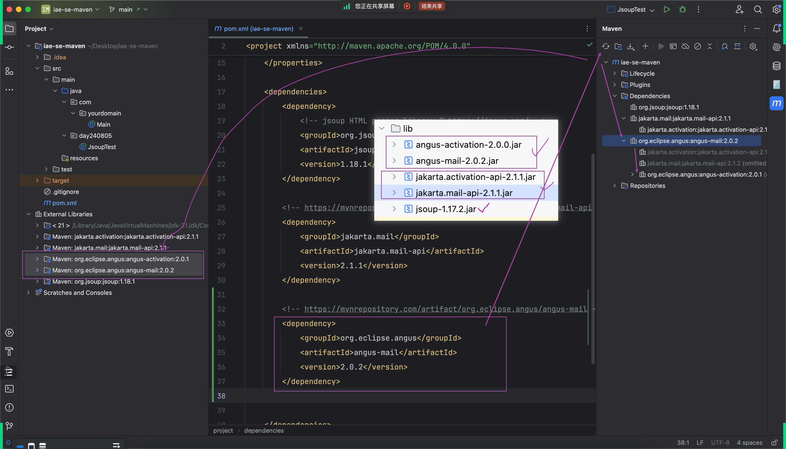

## 关于 push
- - 在 push 中可以选择不让 idea 自动帮我们添加进入，后续 commit 时会自动帮我们增加进再commit
- 
- - 可以在这里选择是否添加
- 

## 关于 maven
- - 可以让 maven 自动帮我们添加所需要的依赖，这就使得我们可以不用使用传统的老方法添加 jar 包
- - 已经添加的依赖可以在这里看，添加的方法就如桶紫色方框中一样
- 
- - 在依赖中修改版本重新加载后， maven 会帮忙重新下载对应版本
- 
- - 纵使将对应文件删除后依赖还在可以重新下载回来
- 
- - 自动化帮我们管理依赖
- 

### 获取更多的依赖
- https://mvnrepository.com
- - 这个网址可以获取更多第三方的 jar 包，其中就包含依赖
- 

### 依赖也有依赖
- 
- 
- - 当其他的依赖被获取后还需要某个依赖才能使用时，maven 会自动帮你获取对应依赖