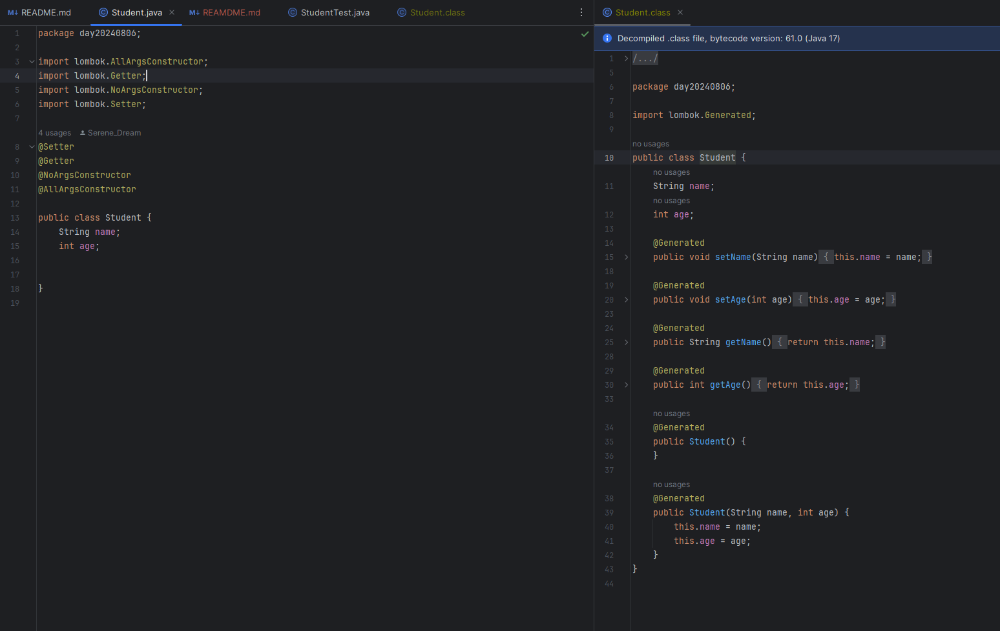
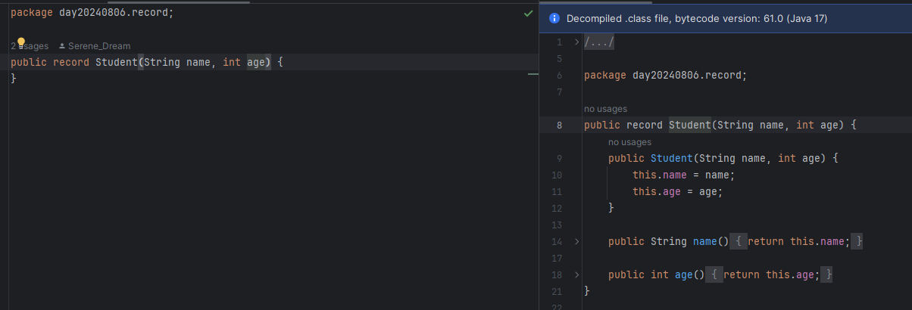
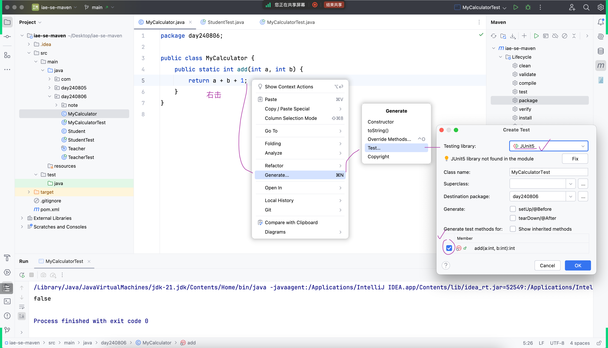
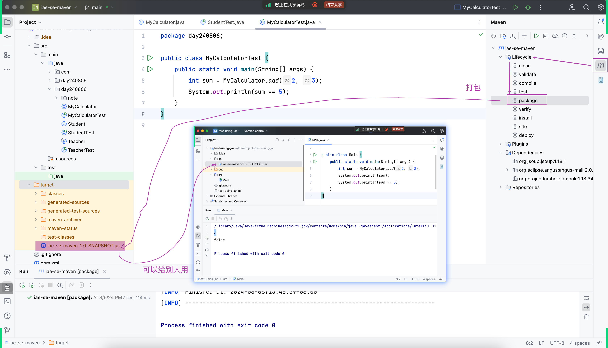
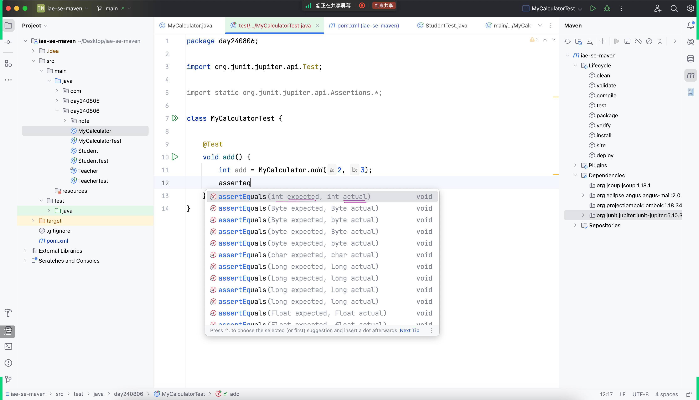
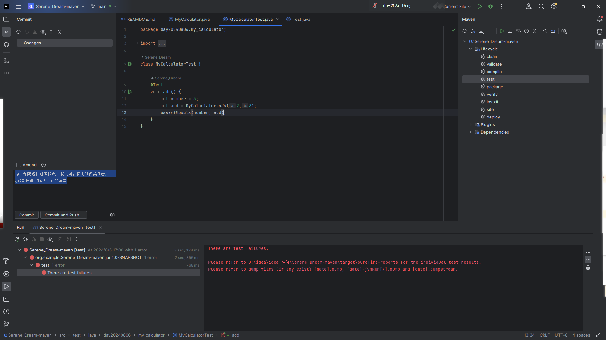
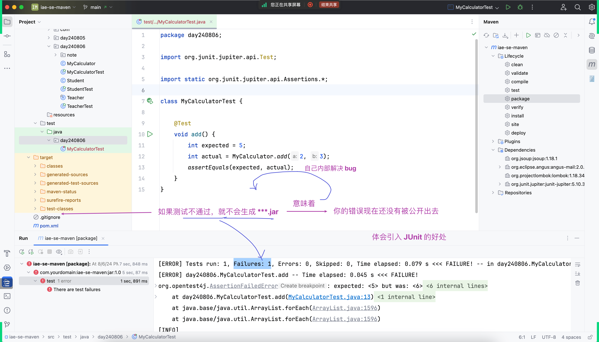
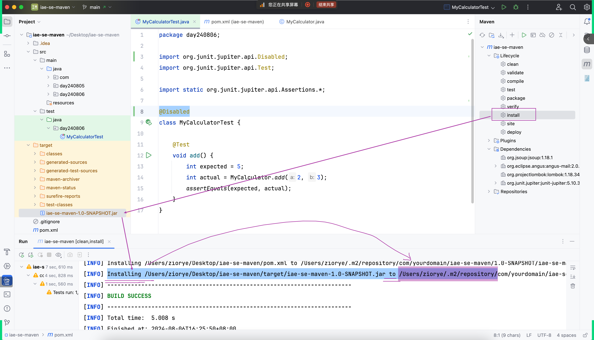

## Lombok
### 实践中产出疑问
- 根据实践可以发现，在 Lombok 中只要添加对应说明就可以使用对应的方法，这是为什么呢？
### 寻找问题的答案
- 
- - 通过打开 .class 文件我们可以知道，在添加对应标签后 Lombok会帮我们添加对应的方法
## record
- 
- - 官方提出的新修饰词，会在编译阶段自动帮我们补齐

## maven
- - 创建一个测试代码
- 
- - 快捷打包成 jar 包
- 
### 致命的逻辑错误
- - 如果在逻辑层面出错代码并不会报错，我们很容易这样子不小心把打包的错误的 jar 包给别人用
- - 这就需要用到测试类了
- 
- - 为了预防这种逻辑错误，我们可以使用测试类来看预期值与实际值之间的偏差
- 
- - 测试不通过会报错
- 
- - 引入 JUnit 的好处
- 
- - 在 jar 包下载好后会放置在 .m2 包下
- 

